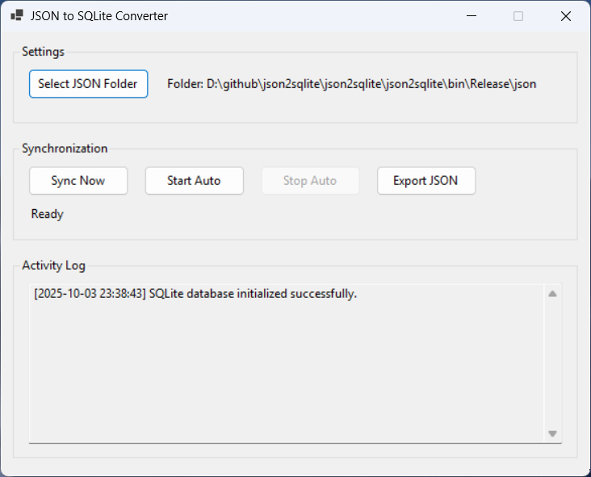

# JSON to SQLite Converter

A lightweight Windows desktop application that converts JSON files to SQLite database and vice versa. Perfect for managing data from Electron apps with automatic hourly synchronization to prevent data loss during power outages.

## Features

- ✅ **Bidirectional Conversion**: JSON → SQLite → JSON
- ✅ **Automatic Sync**: Hourly automatic updates to prevent data loss
- ✅ **32-bit Compatible**: Runs on Windows x86 systems
- ✅ **Smart Schema Detection**: Auto-creates tables based on JSON structure
- ✅ **Batch Processing**: Handles multiple JSON files at once
- ✅ **Simple UI**: Clean, lightweight Windows Forms interface
- ✅ **Activity Logging**: Track all operations and errors
- ✅ **Persistent Settings**: Remembers your folder selections

## Screenshots



## Requirements

- Windows OS (32-bit or 64-bit)
- .NET Framework 4.7.2 or higher
- Visual Studio 2019 or later (for building from source)

## Installation

### Option 1: Download Release (Recommended)

1. Go to [Releases](../../releases)
2. Download the latest `JsonToSqlite.zip`
3. Extract and run `JsonToSqliteApp.exe`

### Option 2: Build from Source

1. Clone this repository:

   ```bash
   git clone https://github.com/yourusername/json-to-sqlite-converter.git
   cd json-to-sqlite-converter
   ```

2. Open `JsonToSqliteApp.sln` in Visual Studio

3. Install NuGet packages:

   - `System.Data.SQLite.Core`
   - `Newtonsoft.Json`

4. Set build configuration to **x86** (for 32-bit compatibility)

5. Build the solution (Ctrl+Shift+B)

6. Run the application (F5)

## Usage

### JSON to SQLite

1. Click **"Select JSON Folder"** and choose your folder containing JSON files
2. Click **"Sync Now"** to process files immediately, or
3. Click **"Start Auto"** to enable hourly automatic synchronization
4. All data is saved to `data.sqlite` in the application directory

### SQLite to JSON

1. Click **"Export JSON"** button
2. Select destination folder for exported JSON files
3. Each SQLite table will be exported as a separate JSON file

### JSON File Format

The app supports both JSON arrays and single objects:

**Array format:**

```json
[
  { "id": 1, "name": "John", "active": true },
  { "id": 2, "name": "Jane", "active": false }
]
```

**Object format:**

```json
{ "id": 1, "name": "John", "active": true }
```

## Configuration

Settings are automatically saved in `settings.json`:

- JSON folder path
- SQLite database path

## Project Structure

```
JsonToSqliteApp/
├── MainForm.cs           # Main application logic
├── MainForm.Designer.cs  # UI design code
├── Program.cs            # Application entry point
├── data.sqlite           # SQLite database (auto-created)
└── settings.json         # User settings (auto-created)
```

## Technical Details

- **Language**: C# (.NET Framework 4.7.2)
- **UI Framework**: Windows Forms
- **Database**: SQLite
- **JSON Parser**: Newtonsoft.Json
- **Build Target**: x86 (32-bit compatible)

### Data Type Mapping

| JSON Type | SQLite Type   |
| --------- | ------------- |
| Integer   | INTEGER       |
| Float     | REAL          |
| Boolean   | INTEGER (0/1) |
| String    | TEXT          |
| Date      | TEXT (ISO)    |
| Object    | TEXT (JSON)   |
| Array     | TEXT (JSON)   |
| Null      | NULL          |

## Contributing

Contributions are welcome! Please feel free to submit a Pull Request.

1. Fork the repository
2. Create your feature branch (`git checkout -b feature/AmazingFeature`)
3. Commit your changes (`git commit -m 'Add some AmazingFeature'`)
4. Push to the branch (`git push origin feature/AmazingFeature`)
5. Open a Pull Request

## Known Issues

- Large JSON files (>100MB) may take longer to process
- Nested JSON objects are stored as JSON strings in SQLite

## Roadmap

- [ ] Add database encryption support
- [ ] Support for MySQL/PostgreSQL export
- [ ] Command-line interface option
- [ ] Custom sync intervals
- [ ] Data validation rules

## License

This project is licensed under the MIT License - see the [LICENSE](LICENSE) file for details.

## Author

Your Name - [@yourhandle](https://twitter.com/yourhandle)

Project Link: [https://github.com/yourusername/json-to-sqlite-converter](https://github.com/yourusername/json-to-sqlite-converter)

## Acknowledgments

- Built to solve data persistence issues in Electron apps
- Inspired by the need for lightweight alternatives to Electron
- Thanks to the SQLite and Newtonsoft.Json communities
